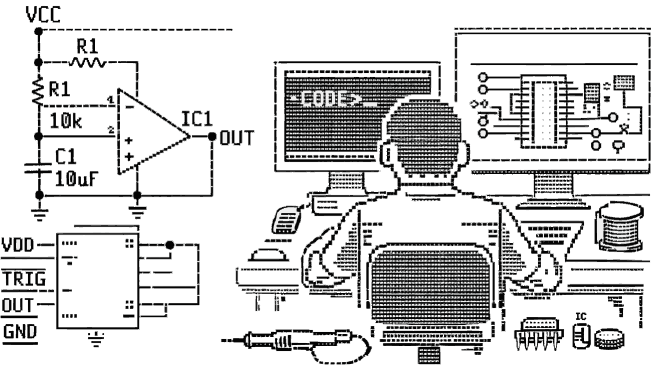

AsciiCAD is a browser-based ASCII / UTF-8 schematic editor designed to embed **digital and electronic schematics directly inside source code**.  Instead of external CAD files, schematics become **readable text** that lives next to the firmware, HDL, or documentation it describes.

Try it online:  
- <a href=https://beyondmicrocontrol.github.io/AsciiCAD/index.html>RUN AsciiCAD</a>
- <a href="https://beyondmicrocontrol.github.io/AsciiCAD/index.html?d=eNqtlU9rgzAYxu9+ive+i//qztaMUuamLK4USj9ALztvt9bzDhYilcEYlMEuhX2nfJIlqV3VRk1VCZo3kDy/503eOHlEQMlm6ParPKjaNGh+KIn/O9rNaMa+a0oO4j1Ui9sGr5bTyuwtvnJ3/ebQlNA06dp2ratvgR6+ARZuFK1e3uamvYTjcPtEiRP5PPF+V0hwclIg+Ui6h5nnFRQmvADSr9OETKZUp5ecPUCjA6im/efK/k5QlNX2ELp2HmHvnkUWd3JW5da4Wez5gJGbb87FOs3UW7VES1IvV+PUI4CnuQEPUxywyCxSy441r7Fu5GKtBcbIsHRn2bgW53IAIs4V4CmLjAsux4ZXsEwI/DvUn0vNI+e6PQbPIeJcepmLdNqdrAv5R4+L41PubWyxo6CLE+yzSC/Woqiw+htOlbz+ppQTmewQCCJWMuHYqBDFA/1Lsopyv9wWr7iB+P4AnMC7VA==#">RUN AsciiCAD with schema in URI</a>

**Caution**: AsciiCAD does not replace the need for a real CAD program for electronic schema design, but when downloading (e.g. Arduino) source code, a simple embedded schematic enables fast prototyping and getting its associated code running in no time.

---

## Why AsciiCAD?

- Schematics as plain text, close to the code
- Clean Git diffs
- No binaries, no lock-in
- Schematics stay close to code
- Ideal for MCU, CPU, and digital designs

---

## Features at a glance

- Drawing & Layout Tools
  - Freeform drawing
  - Orthogonal line routing
  - Box drawing modes
  - Free text placement
- Selection & Editing
  - Area selection
  - Move, Copy, Paste, Blank (rectangle)
- Component Catalog
  - Integrated component catalog
  - Parameterized catalog items
- Highlighting & Analysis
  - Schema Highlight
  - Schema Match
- Navigation & View
- History & Persistence

---

## AsciiCAD Lab

<a href=https://beyondmicrocontrol.github.io/AsciiCAD/tools/TOOLS_CATALOG.html>LAB TOOLS</a>

- **Image to Base64**: Helps extending your component catalog. Since catalog items are represented by icons sized at 64x64 pixels and hard-coded as base64 strings.   
- **FileJS**: Helps create URI data for AsciiCAD (index.html?d=...[URI content]...), which provides an all-containing URL loading AsciiCAD with schema included. (<a href="https://beyondmicrocontrol.github.io/AsciiCAD/index.html?d=eNqtlU9rgzAYxu9+ive+i//qztaMUuamLK4USj9ALztvt9bzDhYilcEYlMEuhX2nfJIlqV3VRk1VCZo3kDy/503eOHlEQMlm6ParPKjaNGh+KIn/O9rNaMa+a0oO4j1Ui9sGr5bTyuwtvnJ3/ebQlNA06dp2ratvgR6+ARZuFK1e3uamvYTjcPtEiRP5PPF+V0hwclIg+Ui6h5nnFRQmvADSr9OETKZUp5ecPUCjA6im/efK/k5QlNX2ELp2HmHvnkUWd3JW5da4Wez5gJGbb87FOs3UW7VES1IvV+PUI4CnuQEPUxywyCxSy441r7Fu5GKtBcbIsHRn2bgW53IAIs4V4CmLjAsux4ZXsEwI/DvUn0vNI+e6PQbPIeJcepmLdNqdrAv5R4+L41PubWyxo6CLE+yzSC/Woqiw+htOlbz+ppQTmewQCCJWMuHYqBDFA/1Lsopyv9wWr7iB+P4AnMC7VA==#">EXAMPLE SCHEMA</a>).  We made sure most schematics fit a URI since AsciiCAD unpacks (inflates) the URI data using ZLIB.   FileJS uses the same library to compress schema text files into a small-size URI string, usually below 1024 characters.
---

## Design philosophy

- No frameworks required (plain HTML + JavaScript)
- Works entirely client-side
- Monospace-accurate rendering for real editors (VSCode, Arduino IDE, terminals)
- Designed for readability first, not pixel imitation
- Optimized for human-authored ASCII schematics

---

## Wish-list

- [ ] Refactor index.html (main file) to fully run in a signle file, with no immediate external dependencies 
- [ ] Junction resolution is buggy, for the simple reason it is complex ;-) (single lines, double lines, double thickness lines, etc...)
- [ ] Not all UTF8 characters are monospace-friendly, leading to less perfect character selection (still buggy)
- [ ] Embed a component editor + Import/Export Ascii component catalog

## Status

Actively evolving.  
Focused on correctness, editor compatibility, and expressive schematic text.

