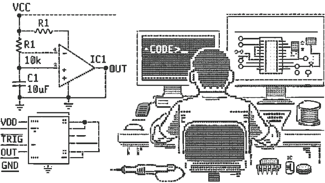

# Presentation

This is a browser-based app built from one of the simplest digital building blocks, once even elevated to an art form, which we will exploit today in a surprising manner: **ASCII**. The project was conceived primarily as an essay in accelerating complexity by methodically embracing bare-bones simplicity at the outset, then letting [policy](docs/design.md) do much of the heavy lifting.

At the heart of the project lies a central thesis: **2D semantics**. While LLMs excel at interpreting plain text when it is presented as a one-dimensional stream of words or tokens, they remain remarkably unprepared for two-dimensional semantics. Humans, by contrast, developed language in a fundamentally multimodal way. Images, speech, music, poetry, and ASCII art. Even considering the lightweight aspect of ASCII tables, schemas, and diagrams compared to typically much denser datasets found in other modalities, differently arranged ASCII data remains [surprisingly difficult for LLMs to decode](https://www.youtube.com/watch?v=rWtMkoRhm-M). That is precisely the challenge this project explores and eventually, helps solve.

Beyond illustrating this broader ambition, a very practical ontology and use case addresses a proof of concept: **embedding digital and electronic schematics directly inside source code**. Traditionally, microcontroller projects rely on separate CAD files that orbit around the codebase. With AsciiCAD, however, schematics made of **readable text** can live alongside the code itself, evolve with it, and remain tightly integrated into the project. **Caution**: this is not a replacement for full CAD applications designed to support an entire PCB workflow end to end. Rather, it is a playful way to prove one can nonetheless speed up and maintain circuit prototyping documentation in a meaningful way.

What makes AsciiCAD especially compelling is that it does more than simply display a schematic visually. Its very 2D arrangement carries enough data density to preserve the metadata and syntax of a wiring diagram, making logical and even electrical simulation possible (for example through SPICE), literally by pasting “just text” into a grid. Some may prefer to keep such a project entirely domain-agnostic, rather than focused on a field like electronics. But by deliberately separating out [specialisation layers](https://github.com/BeyondMicroControl/AsciiCAD/blob/main/docs/design.md#specialisation-layers), the project remains flexible: anyone who wants to fork it for other Computer-Aided Design applications should be able to do so without friction.

Read more about the [design goals](#design-goals), or without further due: 
- <a href=https://beyondmicrocontrol.github.io/AsciiCAD/index.html>Try AsciiCAD</a>
- <a href="https://beyondmicrocontrol.github.io/AsciiCAD/index.html?pako=eNrdm89v4kYUx+/5K+aYaOWGMeZHjqyT3dINoAWCIiEi9ZBrkdpVtO1p41MPq5WRTNZaEXU3QmqrjbQ9bHuo1B76B/SP8F/S5x9jZuyZwQYDk6IJMQYPbz7vzXtfD3blZQW1msdN1Gwfds76qAtPJ120vcfT9jHynGu2fUrtyd42cuwe2vXjUWUAnF4F7Z5sWGQjS7tnX+Y6NtGJ8NjdcwofYGL0lNrL2R/tC/9gGNew4wC2nn794jIxIm/qeFM71d6m+uN/TnyAaCCyfrJ14k3eJ8bsOa/FgZA3Lmw+O3Owt9x4bzqB50P4+NibfmQ6Rd6bv+JGWEzQsNrG5fooOjLL6G9+hM8Ov8J4BMPut+F7qEk1xKV/fn8ykkUReYxTAeQfTQ73HIeiFzMkNGD2+jgmLPmo9XybonemH8fw7zBm4zkzeD3U9dK/v44IGnjvbr9tHiA0ME1v+lOG2S72Hi/mJhcXF9Enbv6G5z7rnXT7xXPer5RP5KYxDtinHTATfPk9RfXtK15kp32DdeIca+Gfm8/hRpcM3SUxR0erHWWaN3/GLWHd9G7w5JF/2OAEPMXmoUSE8/ISig2zyLztsjG8PAvO5F4aUy9c1g5/a4jblTqujcIZPkvSg/q9x9roUDZyJvhnygvEWzd/UD278VwAdFqAriMI8kUvQ6NGzRA5SYcObdrF24lum65OJAPt81P9z5y0SQ+Om3o1EtBXV1d0NLOzOJ1pgq7A3QY26qG7SZoBJwceuE8RcfkTwJK5wOGnQDYfiVNz3DvgYdJzND99RRmNioNqjxSEkl8QnP4iUIc92JWoQy7imku9PX0nrfO3vpEwFGMk78kS1F47gU/ybbcsEElOSPomognV9Qyj01r9dCSkt8wEoY23eeUb+XZ+IOVXZJLRO4tc3Yl2Dpok5bhpBltShDIKy6VVXMlgokNoV0fB9EhIKjmZZRHHdS4VKVtVfxJa8ZSv0howjnrGBigkpI7cZ07p1hpnVIU02gBbNaUZmjUXxPESrUlKfMLcRLUR1AcnQ+zOc+4XhfOiFFsKqEl57hAoyvAgJ2KNFqyZbgWsJ8w3/BYafNZ7TCz/lFICAmZqiMj5UnxLZORcnlwsQZ0XEBUWPw5FFWQfF5pc+FF1eNlcp3rn8hr2Ly+/+e57ZHxRGsl5xaVBT6tBXSE1aHOIZtGCS9RYFp6NbguZ429fXL7UWjVULZVaX/4gi7+t6kPxqUZmhZYxpnLMwa3rQ66szasQayNBtg97f708UKd30bmX6DFotqkk7CqgFTnk4pRQy6UW53HHMPNSuJKguucYIbN7rsNBWon3q0iqWrlUmVRQ2/FjsCh1x6ZLSw63H8Dth3BxCm55UBYMN5AVkw9K6TcB1wIUHDO9LQTDuAv2d876ATl40ssaapmnz7Afq0CycQRmj1XVajJUhaq1tEk2h+NpF8jpSCsDR12L7DGD4GzUY467V2tCbIXpNbaoJjk9DjAhzQBOWAteYtQ97/naoyYIBHuh3Mpp5VZWQrnZArLF6TY512bbn8ZIqwDXEom/fsi1Kp1gLOntarrFXwLzNUL4YOtrKqJ44RKHzIlBAGlVMPUIiPfMU1LbGxV/xjPO24VW5JKN+eqK8E18IC2e9JB1A1jXgHXdZ33ciFkbfNY7UpnShAHUy4pQp1M6R1PpfkYJ1JRWB+a1kDmGjGL4zMsZMoqtsoQVnOLEbjJ27iZbJtmwCY45AsdUw8Tjl9DAMXoKjM0WfoXkruRUEzxQ2aEHmGLOzurpXet5r4vMXjA+DZcQrpBy2z0v+z7AlA/stPRSU1ALHQKuqG7TFXM4Y2MsisPInwCtTq8ZyWqAjxE2FlongF+ixm6JVZoSalzAHYjXfOLBZYCrrm4x9NiSBBSbvQ6COD4NKOoIw5lfeM7XM5/BuczJcVBT+XZS66hGWo0bSqhxl7aXoAWu9YO4wuddMavLV8xY7b/SWqISa6skMS3eJs6ur7hClkLzLs+Pbeu0WwnenS3b+oDjSzeCrSIXzqxMi+RZTshUWaxlx7L+Ylgmob6T5oo8oPYaMN9BBS3B2Yr6Suo3JZeUOW4qaMlPfQ8JvaX64nbSaUWtJj4cd3Fdp9haurzcZtPs694Aw+jySlqXVxS6vsHlxnZOPX40Wna90hokt6W+Z4L1HzdxDw9x7FF+DV4IDlRMTzNhsG30IsHdjnzyIe/NHvkvzdvpCKO7zla9BWP1X2MfVN3a2N2Sxf96u1ZQbXCcxf6WquYot68eNu21fHUdlzZR1zc6xviu01Ku6uyq7ri16zBSfoSr1t8HMrL1Ku//prlq115FK+Z/qFX92A==">Try AsciiCAD + example schema</a>
- <a href="https://beyondmicrocontrol.github.io/AsciiCAD/dist/AsciiCAD.html?download=self">Download AsciiCAD.html</a> - the all-in-one portable file.

---

# Documentation

| File | Read When... |
|------|--------------|
| [User manual](docs/AsciiCAD_User_Manual.md#quick-start) | Getting started and learning how to use the App. |
| [Change Log](docs/decisions.md) | Learning how the App evolved, and will continue so. |
| [Design Strategy](docs/design.md) | Discussing approach, writing policy or making design decisions. Understanding why something was built a certain way. |
| [How to contribute](docs/style-guide.md) | Bringing up new ideas or learn to add new features. |

<!--| [Contrinute - testing] | Writing tests or discuss a test strategy |-->
<!--| working-agreement.md | Starting any session |-->
<!--| refactoring.md | Code needs improvement or restructuring |-->
<!--| design-patterns.md | Solving a design problem or choosing an approach |-->
<!--| domain-language.md | Discussing domain concepts or naming on electronic design |-->
<!--| decisions.md | Understanding why something was built a certain way |-->

---

# Specification

| Draw Modes | Component Catalog | Tools | Select & Edit | Navigate | History & Persistence | Terminal |
|---------------|-------------------|-------|---------------|----------|-----------------------|----------|
| Freeform drawing & Free text | Catalog picker | Schema highlight | Area selection | Large grid support | Undo / Redo Clear | CLI
| Orthogonal line routing | Parameterised catalog items | Schema match (extraction) | Move, Copy, Paste, Blank (rectangle) | Pan, Zoom | Load / Save Permalink | Scripting (basics)
| Box drawing | | Netlist highlight  & report | | |

---

# Experimentation

## AsciiCAD Lab

<a href=https://beyondmicrocontrol.github.io/AsciiCAD/tools/TOOLS_CATALOG.html>LAB TOOLS</a>

- **Main App Debugger**: <a href="https://beyondmicrocontrol.github.io/AsciiCAD/tools/AsciiCAD_debug.html">AsciiCAD debug</a>
- **Inline Image Lab**: [Image2Base64](https://beyondmicrocontrol.github.io/AsciiCAD/tools/Image_to_Base64.html) helps extending the component catalog. Since catalog items are represented by icons sized at 64x64 pixels and hard-coded in as base64 strings, this is the tool we need.
- **Picking the perfect glyph**: Requires a toolchain with
   -  A tool [generating training data](https://beyondmicrocontrol.github.io/AsciiCAD/tools/AsciiCAD_helper_tools/README.md) built from the most common UTF-8 glyphs (offline python script)
   -  [Font to BMP](https://beyondmicrocontrol.github.io/AsciiCAD/tools/UTF8_to_bmp.html): to rasterise one glyph, and model its bitmap to what we approximately need
   -  [Score Glyph](https://beyondmicrocontrol.github.io/AsciiCAD/tools/score_glyph.html): generating a top-list of UTF-8 characters that are most resembling to any given bitmap   
- **Persistence Lab**: Helps create URI data for AsciiCAD (index.html?d=...[URI content]...), which provides an all-containing URL loading AsciiCAD with schema included. - <a href="https://beyondmicrocontrol.github.io/AsciiCAD/index.html?d=eNrdm8tu20YUhvd+ilnGCFhrqKuXjuykaiwJlWTBgCADXXhbA21gpF3FWnURBBRAOUQgo6mq9IIYSBduFwXaRR+gD8En6eFlyBnORSQtiZMKY1miyNGZ75w55+eIrD6vonbrsIVanb3uyQD14Omoh7b3eNI5RK59xbYP3Jb0bSPH7qCiHw+rQ+D0wm+35MWEvEjTbtm3mY5NdCI9tnhOwQNMDJ+4rYLt4bbgD4ZxBRt24dWTL56dJ0bkzmx3ZnHtNdefeD/5AbKBqPpJ14k7/SkxZtd+KQ+ErHFhidk1hzurjXdnU3jeg90v3Nl7plPkvvoraoTFFI1qHVxujMMj04z++jvYd/QZxmMY9qAD30NNqhEu/fP747Eqisjjggsg72hyuGvbFL2IIaEBs9fDMWXJh63v2RR+Mnt/Af/2IjauPYf3I9Ms/fvrmKCBzxYPOs1dhIbNpjv7PsVsl3tPFHPTs7OzcI/rv+F5wHqHb7+49ttc+URtGuOAB7QD5pIvv6Wovn4himzeN9gkzpnE/rm+C170yNAdEnN0tFphpnn1Z9QS1s0Ww8cPvcOGR+ApNg8lIlyUl1Bk2ITM2x4bw6uz4FztpQvqjcPa4b0a4U61gevjYIbPk/Sgfu+wNtqUjYIJfkd5gXjr+g+qZyeaC4DO8NF1JUEe9zKq1KkZoiZp06FNu3g70W3R1YlkoAfiVP+zIG3SgxOmXoME9OXlJR3N7CzmM43fFbi7giuNwN0kzYCTfQ/cckQc8QSYqFxgi1Mgm4/kqTnqHfAw6Tmcn56iDEclQLVDCkLJKwj2IA7UUR82JeqQg4TmUh/P3ijr/I1nJAylMk4kLXVukuRn5bfdsEAUOSHpm5AmVNcTjI7rjeOxlN4qE6Q23qTNV7yZ4lDKrskU47fjbN0NNw5bJOk4PIXNakJ3+jYNh9XyKqpmMNkhvGtjf4okZJWazaqoEzqYipatKkAFrWja12gdGEU+YwMUE1JLblOn9ck9zqrW0mgDLN3UZmDWUhLHK/QmKfMJcxMVR1Ij7BSxu8y4XRbOcTmeaKAo1blDoiqDg+yQNYpZM91KWE+Zb/gtMPik/4hY/oFTAxJmegjJ5Up8K6TkUp1cJpJaLyEqLX8CijpIPyE0tfijKvGquS4SCzSv0eD8/Muvv0GVT0pjNa+oNJi8IjQ1UoSWgGgaPbhCkaXhedBro+bFV8/OnxvtOqqVSu1Pv1XF35Y1ovyEI7VKSxlVGWbhpjXiD+k4ZFaJ9bEk4we9v1wdrLNFeA4mewxbHSoROxroRQG5KC3UMynGZdQxzD4OVxJU7xQj1OydmnCQURL9OsJVLIcqlRrqO3EMrkvhscl3ooY78OEOAriYg1seliXD9aXF9J1WGk7CdQ0qjpneEwTDWPjbuycDnxw8mWUDtZvHT7EXq0DyYB/MvtBVr6lQrVWx8SZZAo7HPSBnIqMMHE0jtKfpB+dBI+JYvGKTYluXZvNqlr+2EZfWJKtHPipkVIAVNvy3GPVO+54GqUuCwYoVXJlXcGUtFJwlobs2/cYh5dm2Ot50RkYV2JZIHA4CtjXlRGNpb1vfxX8Jt10hhHe3vsJCv75jNYwwh2KQQkYNTN0H5v3mManyB1Vv7jOD3opuXIj5CqcEEDaLInyn3IEXUmZA+wBo14F2w6N9eBDRrohpF6Q4lSkIqJeLoi74scqW6yvTyyq+sjIawLweMMeQVSoe83KKrGLpLGclpzuRmyqFu8lSyTfcBMfsg2NqQerxSqnvGJMDY7F1RCPpqzjtBA9UC/QAU9TZWT1btD/v91Cz74/PwCWEq6Tk9k7Lng8w5QOLl2F6imupQ8AVtW26Yglnb4xFURh5E6Dd7bdCiQ3wMcKVWO/48EvU2CdytaaFMpdwB+J1j7h/aWDetS6GHluSgGKr30UQx8c+RRNhOAsMzv/6zadwXnN06NdUsZ3UumqFV+UVLVS5Q9tL0ALXxm5U4bOunjXUq2fsOUCulUVN1lpJaoo/Ju5u5Fwv4+C8yfLz233ajQLwpuX4j2rE0SUd/qt1LqRNUi2bI4WE5UKx4MVbdiz3XxyL+50X97O+LB2KPaCniJbVWWVLLNgxHzFLdtT+6j2FUs6i3s6LvoYji8u1XJ0WTME1rR7SE3GisZ8E3tJ9nTzptHUtSoouitfZaYKfIzValldX6lySP+edNYy4r/LivqrRRROOMMIzivr9LKI+H8/tCXlZkXMSNwkRB+/nkPPTpa9sqcXmvFhy3wE2XbJ9zaXBt9ErEYsYOwXhXda7SrJf/1foCMPb2/Le65H/596PpTlrA43y3c+R4ZK+ewfVBse5vgvt9B1lPk2hs9ey1XlcGm8g2W10jNHtraVMVdrR3XH3rsNI+xHmrb8fycjuV3n/N83Ru/ZqWjH/AyNxXoU=">EXAMPLE SCHEMA</a>.  The [compression test bench](https://beyondmicrocontrol.github.io/AsciiCAD/tools/codecTool.html) helps to make sure most schematics fit a URI since AsciiCAD unpacks (inflates) the URI data using a lightweight compression/decompression library.
- **Terminal Lab**
   - A minimal [vanilla-JavaScript terminal](https://beyondmicrocontrol.github.io/AsciiCAD/tools/VanillaTerminal.html)
   - CMD instruction [parser and compiler](https://beyondmicrocontrol.github.io/AsciiCAD/tools/CMD_tool.html)
   - A test bench for secure script execution via a [worker-thread](https://beyondmicrocontrol.github.io/AsciiCAD/tools/WorkerTest.html)

---

# Expectation

## Design goals

Last but not least (we haven't yet reached that point), the Terminal CLI will be used to expand the tools capability from a UI-driven tool to an AI-driven tool.  Wouldn't it be satisfying to see a schematic built in real-time by interacting with an LLM trained in electronic design?  Likely, but here's the thing: the end goal would be to demonstrate one can design an app that conceptially embraces 2 types of agents.  
- One agent in charge of electronic design, which makes the agent a Senior User (PRINCE2) having the ability to do business with the tool (electronic design) and understand business needs that can help to express new requirements.
- A second agent specialised in software design, a Product Delivery Manager as it were, with the ability to create and extend the tool itself and explain to the Senior User how to use the new features implemented as required.

This emulates a necessary **'tension' between operations and projects** that (since sliced bread) has been the succes formula of the <a href="https://www.youtube.com/watch?v=6v8e7dUwq_Q">modern enterprise</a>.

---

## Wish-list

- [ ] Improve the CLI (terminal and script parser, enabler for script automation)
- [ ] Script automation and AI agent interaction
- [ ] Create a built-in catalog item wizard (CADScript-based?)
- [ ] Forge a better plan for junction resolution (single lines, double lines, double thickness lines, etc...)
- [ ] Debug Monospace issues.  Not all UTF8 characters are monospace-friendly, requiring meticuloust character selection (still buggy)
- [ ] Analog circuit simulation (simple filters and op-amp circuits), based on netlist and catalog item parsing
- [ ] Tabbed multi-page grid with cross-page waypoints
- [ ] Improve Netline algorithm
- [ ] MCP service to generate AsciiCAD schema within IDE (VSCode, Arduino,..)

## Status

Actively evolving ==> check [work in progress](docs/decisions.md#work-in-progress)  
Focused on correctness, editor compatibility, and expressive schematic text.

